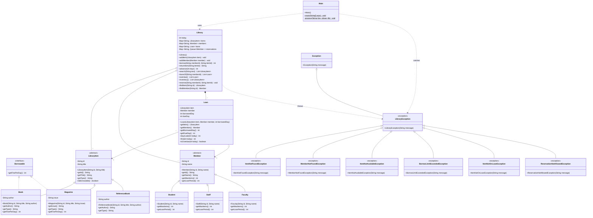

# Library Management Systen
## UML classDiagram

```mermaid
classDiagram

    %% ---------- Items ----------
    class Borrowable {
        <<interface>>
        +getFinePerDay() int
    }

    class LibraryItem {
        <<abstract>>
        -String id
        -String title
        +LibraryItem(String id, String title)
        +getId() String
        +getTitle() String
        +getType()* String
        +isBorrowable()* boolean
        
    }

    class Book {
        -String author
        +Book(String id, String title, String author)
        +getAuthor() String
        +getType() String
        
        +getFinePerDay() int
    }

    class Magazine {
        -String issue
        +Magazine(String id, String title, String issue)
        +getIssue() String
        +getType() String

        +getFinePerDay() int
    }

    class ReferenceBook {
        -String author
        +ReferenceBook(String id, String title, String author)
        +getAuthor() String
        +getType() String
        
        
    }

    LibraryItem <|-- Book
    LibraryItem <|-- Magazine
    LibraryItem <|-- ReferenceBook
    Borrowable <|.. Book
    Borrowable <|.. Magazine

    %% ---------- Members ----------
    class Member {
        <<abstract>>
        -String id
        -String name
        +Member(String id, String name)
        +getId() String
        +getName() String
        +getMaxItems()* int
        +getLoanPeriod()* int
    }

    class Student {
        +Student(String id, String name)
        +getMaxItems() int
        +getLoanPeriod() int
    }
    class Staff {
        +Staff(String id, String name)
        +getMaxItems() int
        +getLoanPeriod() int
    }
    class Faculty {
        +Faculty(String id, String name)
        +getMaxItems() int
        +getLoanPeriod() int
    }

    Member <|-- Student
    Member <|-- Staff
    Member <|-- Faculty

    %% ---------- Loan ----------
    class Loan {
        -LibraryItem item
        -Member member
        -int borrowedDay
        -int dueDay
        +Loan(LibraryItem item, Member member, int borrowedDay)
        +getItem() LibraryItem
        +getMember() Member
        +getBorrowedDay() int
        +getDueDay() int
        +daysLate(int today) int
        +fine(int today) int
        +isOverdue(int today) boolean
    }

    Loan "*" --> "1" LibraryItem
    Loan "*" --> "1" Member

    %% ---------- Library (coordinator) ----------
    class Library {
        -int today
        -Map~String, LibraryItem~ items
        -Map~String, Member~ members
        -Map~String, Loan~ loans
        -Map~String, Queue~Member~~ reservations
        +Library()
        +addItem(LibraryItem item) void
        +addMember(Member member) void
        +borrow(String memberId, String itemId) int
        +returnItem(String itemId) String
        +advance(int days) int
        +search(String text) List~LibraryItem~
        +loansOf(String memberId) List~Loan~
        +overdue() List~Loan~
        +inventory() List~LibraryItem~
        +reserve(String memberId, String itemId) void
        +findItem(String id) LibraryItem
        +findMember(String id) Member
    }

    Library o-- "*" LibraryItem
    Library o-- "*" Member
    Library *-- "*" Loan

    %% ---------- Command loop ----------
    class Main {
        +Main()
        +main(String[] args)$ void
        -process(String line, Library lib)$ void
    }
    Main ..> Library : uses

    %% ---------- Exceptions ----------
    class Exception {
        +Exception(String message)
    }
    
    class LibraryException {
        <<exception>>
        +LibraryException(String message)
    }
    class ItemNotFoundException {
        <<exception>>
        +ItemNotFoundException(String message)
    }
    class MemberNotFoundException {
        <<exception>>
        +MemberNotFoundException(String message)
    }
    class ItemNotAvailableException {
        <<exception>>
        +ItemNotAvailableException(String message)
    }
    class BorrowLimitExceededException {
        <<exception>>
        +BorrowLimitExceededException(String message)
    }
    class ItemNotOnLoanException {
        <<exception>>
        +ItemNotOnLoanException(String message)
    }
    class ReservationNotAllowedException {
        <<exception>>
        +ReservationNotAllowedException(String message)
    }

    Exception <|-- LibraryException
    LibraryException <|-- ItemNotFoundException
    LibraryException <|-- MemberNotFoundException
    LibraryException <|-- ItemNotAvailableException
    LibraryException <|-- BorrowLimitExceededException
    LibraryException <|-- ItemNotOnLoanException
    LibraryException <|-- ReservationNotAllowedException

    Library ..> LibraryException : throws
    Main ..> LibraryException : catches
```